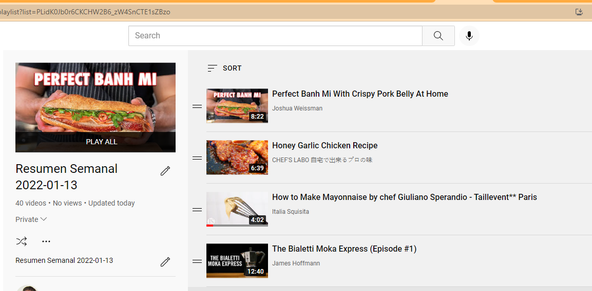

# Qué-lo-que hace este script?

Dado un video del Resumen Semanal del [canal de youtube de Fabio Baccaglioni](https://www.youtube.com/c/FabioBaccaglioni), este *escrí* lee todos los videos que deja Fabio en la descripción y actualiza un playlist tuyo con todos los videos que encuentra.

## Screenshot

# Setup

## Pre-Requisitos de Google Cloud

- Crear un proyeto en https://console.cloud.google.com/

- Seleccionar el Proyecto recien creado.

- Buscar la API "YouTube Data API v3" y darle a "ENABLE"
    - Esperar a que se habilité

- Click en "CREATE CREDENTIALS"

- Seguir los pasos llenando los campos que nos va pidiendo
    - Seleccionar "datos privados"
    - Elegir un nombre de app        
    - Poner nuestro email
    - En Scopes - saltear
    - OAuth Client ID
        - Seleccionar "Desktop App" y elegir un nombre cualquiera.
    - Seleccionar el OAuth client recien creado y poner "Download Json". Guardar el json que lo vamos a usar en el setup.    
- Luego tenemos que ir a "OAuth consent screen" y agregar nuestra cuenta como **Test Users**

## El setup propiamente dicho

- Clonar el Repo

- `pip install -r .\requeriments.txt`

- Actualizar `.\YOUR_CLIENT_SECRET_FILE.json` con el contenido del Json que nos bajamos de la consola de Google.
    
- Ejecutar `git update-index --skip-worktree .\YOUR_CLIENT_SECRET_FILE.json` para no hacer commit por error de nuestros secrets.

# Ejecutar

- Ejecutar `python .\src\main.py` en alguna consola

- Nos va a pedir el id del video del resumen semanal, y opcionalmente el id de nuestro playlist que queremos llenar con los videos de la Descripción que deja Fabio. Si no ponemos un playlist Id, crea uno nuevo.

- Luego de eso, tenemos que autorizar la aplicación usando el link que nos va a aparecer en la consola. Autorizar usando la cuenta con la que venimos trabajando, y seguir todas las instrucciones para autorizar.

- Copiamos el numero que nos da luego de darle autorización y lo pegamos en nuestra consola. Enter.

- Dejamos que el script trabaje.

- Profit.
